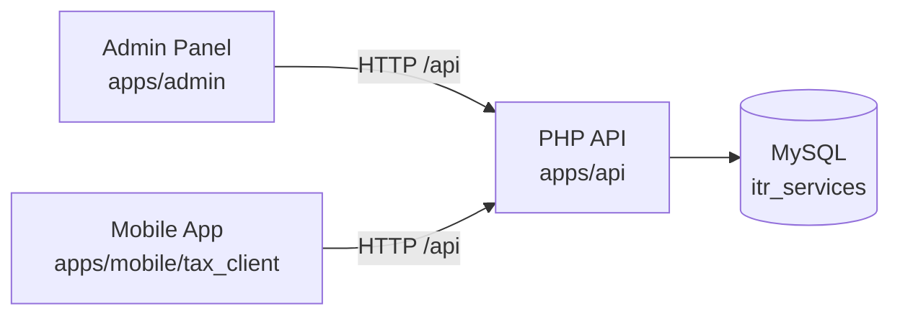

# ITR Platform

Monorepo for the **All India ITR** product stack: a PHP REST API, a React admin panel, and a Flutter mobile app. All clients talk to the same backend.

> **Documentation:** See [`docs/README.md`](docs/README.md) for architecture, API contracts, workflows, Figma reference, and per-project guides.

```
itr-platform/
├── README.md                          # Setup guide (this file)
├── docs/                              # Shared platform documentation
│   ├── README.md                      # Documentation index
│   ├── ARCHITECTURE.md
│   ├── API_CONTRACT.md
│   ├── WORKFLOWS.md
│   ├── FIGMA.md
│   ├── ENVIRONMENTS.md
│   ├── SCREEN_API_MAP.md              # Screen → API quick lookup
│   └── projects/
│       ├── MOBILE.md
│       ├── API.md
│       └── ADMIN.md
├── apps/
│   ├── mobile/tax_client/             # Flutter — FinApp
│   ├── api/                           # PHP REST API
│   └── admin/                         # React admin panel
├── scripts/
│   └── fix-xampp-permissions.sh
└── .github/workflows/                 # CI/CD (optional, later)
```

---

## Architecture



| Project | Stack | Default local URL |
|---------|-------|-------------------|
| **API** | PHP 7.4+, MySQL, Apache (XAMPP) | `http://localhost/api` |
| **Admin** | React 19, TypeScript, Vite, MUI | `http://localhost:5173/admin/` |
| **Mobile** | Flutter 3.8+, Dart ^3.8.1, Riverpod | Device / emulator |

**Production API:** `http://allindiaitr.in`

---

## Prerequisites

Install these once before setting up any project:

| Tool | Version | Used by |
|------|---------|---------|
| [XAMPP](https://www.apachefriends.org/) | Apache + MySQL + PHP 7.4+ | API |
| [Node.js](https://nodejs.org/) | 18+ (LTS recommended) | Admin |
| [npm](https://www.npmjs.com/) | Comes with Node | Admin |
| [Composer](https://getcomposer.org/) | 2.x | API (payment gateways) |
| [Flutter SDK](https://docs.flutter.dev/get-started/install) | 3.8+ | Mobile |
| [Android Studio](https://developer.android.com/studio) | Latest | Mobile (Android) |
| [Xcode](https://developer.apple.com/xcode/) | Latest (macOS only) | Mobile (iOS) |

Optional: [Postman](https://www.postman.com/) for API testing.

---

## Recommended Setup Order

Set up projects in this order — the API is required by both the admin panel and mobile app.

1. **API** — database, config, Apache
2. **Admin** — npm install, env, dev server
3. **Mobile** — Flutter deps, Firebase, run on device

---

## 1. API (`apps/api`)

PHP REST API served by Apache. Uses MySQL database `itr_services`.

### 1.1 Link API to Apache (XAMPP)

The API must be reachable at `http://localhost/api`.

**Option A — Symlink (recommended for this monorepo)**

```bash
# macOS — create symlink from XAMPP htdocs to the repo
ln -sf "$HOME/Android_Projects/itr-platform/apps/api" /Applications/XAMPP/xamppfiles/htdocs/api

# Fix Apache traverse permissions (run after macOS updates if you get 403)
chmod +x scripts/fix-xampp-permissions.sh
./scripts/fix-xampp-permissions.sh
```

**Option B — Copy files**

Copy `apps/api` to your web root:

- **macOS:** `/Applications/XAMPP/xamppfiles/htdocs/api`
- **Windows:** `C:\xampp\htdocs\api`
- **Linux:** `/opt/lampp/htdocs/api`

### 1.2 Start XAMPP services

Open XAMPP Control Panel and start **Apache** and **MySQL**.

### 1.3 Configure database connection

```bash
cd apps/api
cp include/config.local.php.example include/config.php
```

Edit `include/config.php` for local XAMPP (defaults):

```php
$servername = "localhost";
$username   = "root";
$password   = "";              // empty for default XAMPP
$database   = "itr_services";
$key        = 'testitr_key';
$expire     = 36000;
```

### 1.4 Create database & tables

**Option A — Browser setup (easiest)**

1. Open `http://localhost/api/setup.php`
2. Enter MySQL credentials (`root` / empty password)
3. Click **Setup Database**

**Option B — phpMyAdmin**

1. Open `http://localhost/phpmyadmin`
2. Create database `itr_services` (collation: `utf8mb4_unicode_ci`)
3. Import `apps/api/setup_database.sql`

**Option C — MySQL CLI**

```bash
# macOS
/Applications/XAMPP/xamppfiles/bin/mysql -u root < apps/api/setup_database.sql

# Windows
C:\xampp\mysql\bin\mysql.exe -u root < apps\api\setup_database.sql
```

**Admin panel tables (optional, for admin dashboard):**

```bash
mysql -u root itr_services < apps/api/setup_admin_tables.sql
```

**Payment tables (optional, for Razorpay/Paytm):**

```bash
mysql -u root itr_services < apps/api/setup_payment_table.sql
```

### 1.5 Install PHP dependencies (Composer)

Required for payment gateway integration (Razorpay, Paytm):

```bash
cd apps/api
composer install
```

### 1.6 Optional config files

```bash
cd apps/api/include

# Payment gateway (test/live mode)
cp payment_config.php.example payment_config.php

# Push notifications (FCM)
cp firebase_config.php.example firebase_config.php
```

See `apps/api/PAYMENT_SETUP.md` for payment keys and `apps/api/migrations/README.md` for FCM setup.

### 1.7 Uploads directory

```bash
chmod 755 apps/api/uploads/
```

### 1.8 Verify API

```bash
# Database connection
curl http://localhost/api/test_connection.php

# Signup
curl -X POST http://localhost/api/auth/signup.php \
  -H "Content-Type: application/json" \
  -d '{"email":"test@example.com","password":"test123","name":"Test User","mobile":"9876543210"}'

# Login
curl -X POST http://localhost/api/auth/login.php \
  -H "Content-Type: application/json" \
  -d '{"email":"test@example.com","password":"test123","platform":"web","version":"1.0"}'

# Packages
curl http://localhost/api/package/getPackages.php
```

**Test user (after setup):** `test@example.com` / `test123`

**Import Postman collection:** `apps/api/ITR_API_Postman_Collection.json` (set `base_url` = `http://localhost/api`)

### API — Common commands

| Command | Description |
|---------|-------------|
| `composer install` | Install PHP dependencies |
| `php migrations/run_migrations.php` | Run DB migrations |
| Open `http://localhost/api/setup.php` | Web-based DB setup |
| Open `http://localhost/phpmyadmin` | Database management |

### API — Further documentation

| File | Description |
|------|-------------|
| `apps/api/LOCAL_SETUP.md` | Detailed local setup guide |
| `apps/api/QUICK_START.md` | 3-step quick start |
| `apps/api/API_DOCUMENTATION.md` | Full API reference |
| `apps/api/ADMIN_PANEL_SETUP.md` | Admin API endpoints |
| `apps/api/PAYMENT_SETUP.md` | Payment gateway setup |
| `apps/api/CURL_EXAMPLES.md` | cURL examples |

---

## 2. Admin Panel (`apps/admin`)

React + TypeScript dashboard for managing users, orders, payments, and concerns.

### 2.1 Install dependencies

```bash
cd apps/admin
npm install
```

### 2.2 Environment configuration

```bash
cp .env.example .env.local
```

**Local development** — leave `VITE_API_BASE_URL` empty or unset. Vite proxies `/api` → `http://localhost/api` automatically.

```env
# .env.local — development (uses Vite proxy)
VITE_API_BASE_URL=
```

**Production build** — set your live API URL:

```env
VITE_API_BASE_URL=https://allindiaitr.in
```

### 2.3 Run development server

```bash
npm run dev
```

Open: **http://localhost:5173/admin/**

> The API must be running at `http://localhost/api` before using the admin panel locally.

### 2.4 Create an admin user

In phpMyAdmin or MySQL CLI:

```sql
UPDATE users SET Role = 'admin' WHERE Email = 'test@example.com';
```

Or insert a new admin:

```sql
INSERT INTO users (FirstName, LastName, Email, Mobile, Password, Role, Platform, Version, IsActive)
VALUES ('Admin', 'User', 'admin@example.com', '9876543210', 'admin123', 'admin', 'web', '1.0', 1);
```

### 2.5 Build for production

```bash
npm run build
```

Output is written to `apps/admin/dist/`. Deploy under the `/admin/` path on your web server.

### Admin — Common commands

| Command | Description |
|---------|-------------|
| `npm run dev` | Start dev server with HMR |
| `npm run build` | Type-check + production build |
| `npm run preview` | Preview production build locally |
| `npm run lint` | Run ESLint |

### Admin — Further documentation

| File | Description |
|------|-------------|
| `apps/admin/API_SETUP.md` | API proxy & env configuration |
| `apps/api/ADMIN_PANEL_SETUP.md` | Admin API endpoints & cURL tests |

---

## 3. Mobile App (`apps/mobile/tax_client`)

Flutter app (**FinApp - Next Gen**) for end users to file ITR, upload documents, pay, and track status.

### 3.1 Prerequisites

- Flutter SDK 3.8+ with Dart ^3.8.1
- Android Studio (Android SDK, emulator) and/or Xcode (iOS, macOS only)
- Firebase project (Analytics, Crashlytics, Messaging)

Verify Flutter:

```bash
flutter doctor
```

### 3.2 Install dependencies

```bash
cd apps/mobile/tax_client
flutter pub get
```

### 3.3 Code generation

Required after changing Freezed / JSON / Riverpod models:

```bash
dart run build_runner build --delete-conflicting-outputs
```

### 3.4 Firebase setup

Firebase is initialized in `lib/main.dart`. Ensure these files exist:

- **Android:** `android/app/google-services.json`
- **iOS:** `ios/Runner/GoogleService-Info.plist`

Obtain these from the [Firebase Console](https://console.firebase.google.com/) for project `com.finapp.com`.

### 3.5 API base URL

Default production URL is set in `lib/core/constant/api_constants.dart`:

```dart
static const String baseUrl = 'http://allindiaitr.in';
```

**For local API testing**, change to:

```dart
static const String baseUrl = 'http://10.0.2.2';  // Android emulator → host localhost
// or use your machine's LAN IP for a physical device, e.g. 'http://192.168.1.x'
```

> Android emulator: `10.0.2.2` maps to the host machine's `localhost`.  
> Physical device: use your computer's local IP address.  
> Cleartext HTTP is enabled in the Android manifest for development.

### 3.6 Run the app

```bash
# List connected devices
flutter devices

# Run on default device
flutter run

# Run on a specific device
flutter run -d <device_id>
```

### 3.7 Build release APK

```bash
# Requires android/key.properties and signing keystore for release builds
flutter build apk --release
```

### Mobile — Common commands

| Command | Description |
|---------|-------------|
| `flutter pub get` | Install Dart/Flutter packages |
| `dart run build_runner build --delete-conflicting-outputs` | Generate Freezed/JSON/Riverpod code |
| `flutter run` | Run in debug mode |
| `flutter build apk --release` | Build Android release APK |
| `flutter build ios --release` | Build iOS release (macOS + Xcode) |
| `flutter test` | Run unit tests |

### Mobile — Further documentation

| File | Description |
|------|-------------|
| `apps/mobile/tax_client/DEVELOPMENT.md` | Architecture, routing, API layer, theme, build notes |

---

## Full Local Development Workflow

Run all three projects together:

```bash
# Terminal 1 — Start XAMPP (Apache + MySQL) via XAMPP Control Panel

# Terminal 2 — API is served by Apache at http://localhost/api
# (no separate start command if symlinked/copied to htdocs)

# Terminal 3 — Admin panel
cd apps/admin && npm run dev

# Terminal 4 — Mobile app
cd apps/mobile/tax_client && flutter run
```

**URLs when everything is running:**

| Service | URL |
|---------|-----|
| API | http://localhost/api |
| phpMyAdmin | http://localhost/phpmyadmin |
| Admin panel | http://localhost:5173/admin/ |
| API test | http://localhost/api/test_connection.php |

---

## Environment Variables Summary

| Project | File | Key variables |
|---------|------|---------------|
| API | `apps/api/include/config.php` | `$servername`, `$username`, `$password`, `$database`, `$key` |
| API | `apps/api/include/payment_config.php` | Razorpay/Paytm keys, `$payment_mode` |
| API | `apps/api/include/firebase_config.php` | Firebase project ID, service account path |
| Admin | `apps/admin/.env.local` | `VITE_API_BASE_URL` (empty for local proxy) |
| Admin | `apps/admin/.env.production` | `VITE_API_BASE_URL` (production API URL) |
| Mobile | `lib/core/constant/api_constants.dart` | `baseUrl` (compile-time constant) |

> Never commit `config.php`, `.env.local`, payment keys, or Firebase service account JSON to git.

---

## Troubleshooting

### API returns 403 on macOS (XAMPP + symlink)

Apache cannot traverse your home directory. Run:

```bash
./scripts/fix-xampp-permissions.sh
```

### API — "Connection failed"

1. Confirm MySQL is running in XAMPP
2. Check credentials in `apps/api/include/config.php`
3. Verify database exists: `http://localhost/phpmyadmin`

### Admin — API requests fail / CORS errors

1. Ensure API is running at `http://localhost/api`
2. In development, leave `VITE_API_BASE_URL` empty (Vite proxy handles CORS)
3. Do not call `http://localhost:5173/api/...` directly — use the proxy via `/api/...`

### Mobile — Cannot reach local API

1. Use `10.0.2.2` (Android emulator) or your LAN IP (physical device), not `localhost`
2. Ensure phone/emulator and computer are on the same network
3. Confirm Apache is listening on all interfaces (not just 127.0.0.1)

### Mobile — Firebase init fails

1. Verify `google-services.json` (Android) and `GoogleService-Info.plist` (iOS) are present
2. Run `flutter clean && flutter pub get`

### Composer / PHP version issues

API requires PHP >= 7.4. Use the PHP bundled with XAMPP:

```bash
/Applications/XAMPP/xamppfiles/bin/php -v   # macOS
```

---

## Scripts

| Script | Purpose |
|--------|---------|
| `scripts/fix-xampp-permissions.sh` | Fix macOS directory permissions so Apache can follow symlinks to `apps/api` |

---

## License & Support

This is a private monorepo. For API endpoint details, see `apps/api/API_DOCUMENTATION.md`. For mobile architecture, see `apps/mobile/tax_client/DEVELOPMENT.md`.
