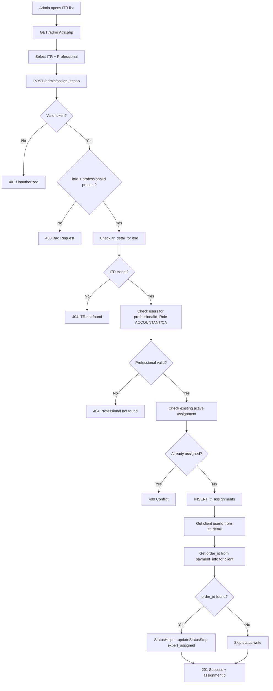
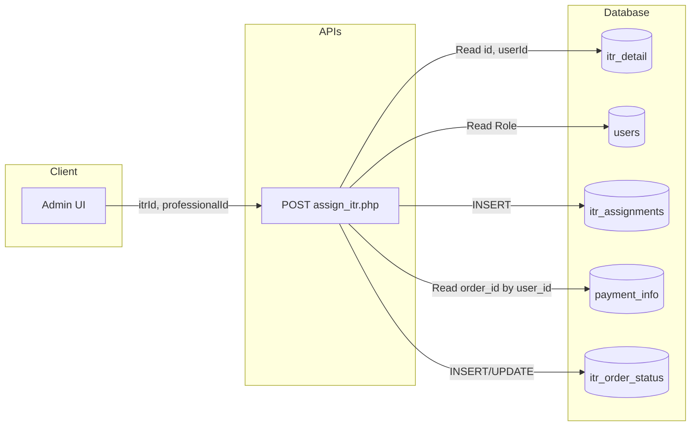
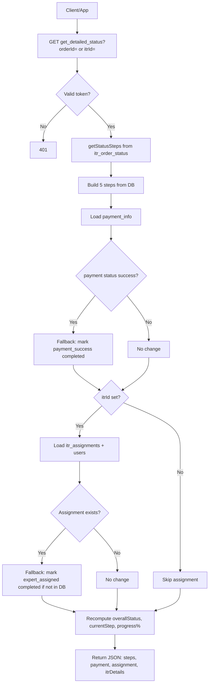
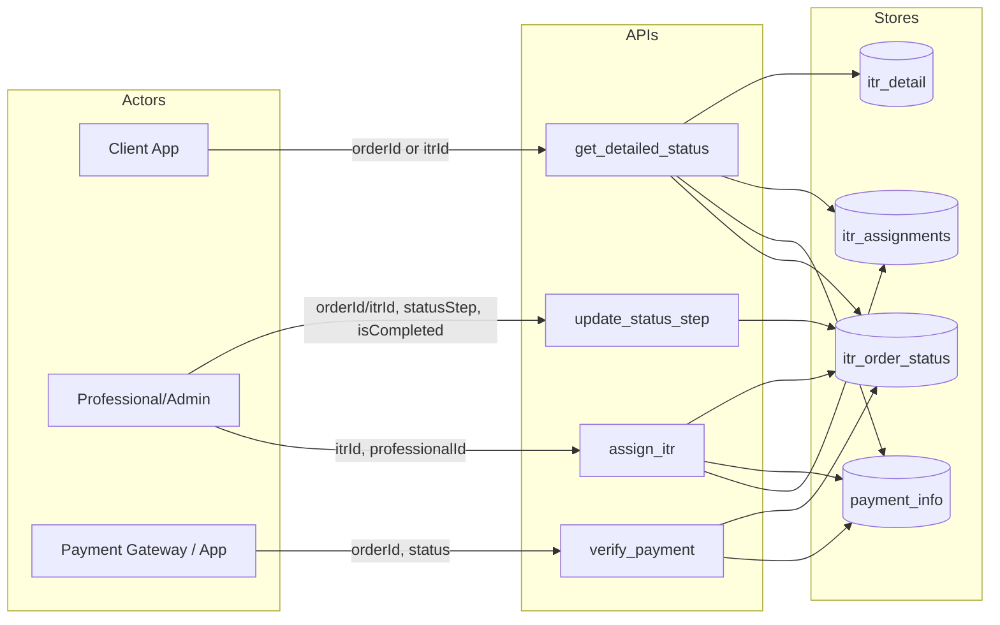

# ITR Assignment & Status Update – Process Documentation

This document describes two core journeys in detail: **ITR Assignment** and **Status Update**, including APIs, database tables, data flow, and flowcharts. Use it to decide the next steps for your system.

---

# Part 1: ITR Assignment Process

## 1.1 Overview

**Purpose:** An admin (or authorised user) assigns an ITR case (`itr_detail.id`) to a tax professional (ACCOUNTANT or CA). The assignment is stored so the professional can work on the case and the client can see “Tax Expert Assigned” in the status flow.

**Outcome:** The ITR is linked to a professional; optionally the status workflow is updated so the “expert_assigned” step appears as completed to the client.

---

## 1.2 APIs Involved

| API | Method | Purpose | Auth |
|-----|--------|---------|------|
| **POST /admin/assign_itr.php** | POST | Assign an ITR to a professional | Bearer (ADMIN) |
| **GET /admin/get_assignments.php** | GET | List assignments (filter by itrId, professionalId, etc.) | Bearer (ADMIN/ACCOUNTANT/CA) |
| **GET /admin/itrs.php** | GET | List ITRs (with assignments); used to pick an ITR to assign | Bearer (ADMIN/ACCOUNTANT/CA) |

**Primary API for the assignment journey:** `POST /admin/assign_itr.php`

---

## 1.3 Database Tables

### itr_assignments

Stores who is assigned to which ITR.

| Column | Type | Description |
|--------|------|-------------|
| id | int | PK |
| itr_id | int | FK → itr_detail.id |
| assigned_to | int | FK → users.UserId (professional: ACCOUNTANT/CA) |
| assigned_by | int | FK → users.UserId (admin who assigned) |
| assigned_at | datetime | When assigned |
| is_active | tinyint | 1 = current assignment |
| (optional) order_id | varchar | Order reference; not always populated |

### itr_detail

One row per ITR case (user + PAN + year, etc.).

| Column | Type | Description |
|--------|------|-------------|
| id | int | PK (this is **itrId**) |
| userId | int | FK → users (client) |
| panNumber | varchar | PAN |
| financialYear | varchar | e.g. 2023-24 |
| status | varchar | PENDING, ASSIGNED, etc. |

### users

| Column | Type | Description |
|--------|------|-------------|
| UserId | int | PK |
| Role | varchar | ADMIN, CLIENT, ACCOUNTANT, CA |
| FirstName, LastName, Email, Mobile | — | For display |

### payment_info (used by assign_itr to link order_id)

| Column | Type | Description |
|--------|------|-------------|
| order_id | varchar | e.g. ORD17731748193D2FB6 |
| user_id | int | Client who paid |
| payment_status | varchar | success, pending, failed |
| paid_at | datetime | When payment succeeded |

### itr_order_status (optional write from assign_itr)

| Column | Type | Description |
|--------|------|-------------|
| order_id | varchar | Same as payment_info.order_id |
| itr_id | int | FK → itr_detail.id |
| user_id | int | Client |
| status_step | varchar | expert_assigned |
| is_completed | tinyint | 1 = step done |

---

## 1.4 Step-by-Step Assignment Flow

1. **Admin opens ITR list**  
   - Calls `GET /admin/itrs.php` (optional: `?professionalId=...`).  
   - Response includes `itrDetails[].itrId` and other data.

2. **Admin selects an ITR and a professional**  
   - Chooses `itrId` (e.g. 24) and `professionalId` (e.g. 2).

3. **Client calls POST /admin/assign_itr.php**  
   - Body: `{ "itrId": 24, "professionalId": 2 }`  
   - Headers: `Authorization: Bearer <admin token>`

4. **assign_itr.php logic**  
   - Validates token (ADMIN).  
   - Validates `itrId` and `professionalId`.  
   - Checks `itr_detail` for `id = 24` → gets `userId` (client).  
   - Checks `users` for `UserId = 2` and `Role IN ('ACCOUNTANT','CA')`.  
   - Checks no active assignment already: `itr_assignments WHERE itr_id = 24 AND is_active = 1`.  
   - **INSERT** into `itr_assignments`: `(itr_id, assigned_to, assigned_by, assigned_at, is_active)`.  
   - **Optional:** Resolve `order_id` from `payment_info` for that client (`user_id`, `payment_status='success'`, `ORDER BY paid_at DESC LIMIT 1`), then call `StatusHelper::updateStatusStep(..., 'expert_assigned', true, ...)` so that **itr_order_status** gets a row for “expert_assigned” for that order.

5. **Response**  
   - 201 with `assignmentId` on success; 4xx/5xx on validation or DB error.

---

## 1.5 Flowchart – ITR Assignment

---

## 1.6 Data Flow Diagram – ITR Assignment

---

## 1.7 Important Notes – Assignment

- **Link order ↔ assignment:** The client app often calls **get_detailed_status** with **orderId** only. To show “expert_assigned” there, either:  
  - **assign_itr** must write to **itr_order_status** with the **same order_id** the client uses (resolved from **payment_info** for that client), or  
  - **get_detailed_status** must resolve **itrId** from **itr_assignments** when only **orderId** is sent, then load assignment and apply fallback.
- **itr_assignments** is the source of truth for “who is assigned”; **itr_order_status** is the source of truth for “which step is completed” in the 5-step workflow.

---

# Part 2: Status Update Process

## 2.1 Overview

**Purpose:** Track and display a 5-step workflow for each order/ITR: Payment Success → Expert Assigned → Documents Verified → Filing ITR → Acknowledgement Generated. Steps can be completed automatically (e.g. payment, assignment) or manually by professionals (e.g. documents_verified, filing_itr).

**Outcome:** Client and admin see current step, progress %, and which steps are completed; professionals can mark steps complete and raise concerns.

---

## 2.2 The 5 Status Steps (Order)

| Order | Step code | Title | Who sets it |
|-------|-----------|--------|-------------|
| 1 | payment_success | Payment Success | Automatic (verify_payment / webhook) |
| 2 | expert_assigned | Tax Expert Assigned | Automatic (assign_itr) or fallback from itr_assignments |
| 3 | documents_verified | Documents Verification | Professional (update_status_step) |
| 4 | filing_itr | Filing ITR | Professional (update_status_step) |
| 5 | acknowledgement_generated | Acknowledgement Generated | Professional (update_status_step) |

---

## 2.3 APIs Involved

| API | Method | Purpose | Auth |
|-----|--------|---------|------|
| **GET /itr_status/get_detailed_status.php** | GET | Get full status for an order/ITR (steps, payment, assignment, itrDetails) | Bearer (CLIENT/professional) |
| **POST /payment/verify_payment.php** | POST | Confirm payment success; writes **payment_success** to itr_order_status | Bearer (CLIENT) |
| **POST /admin/assign_itr.php** | POST | Assign expert; can write **expert_assigned** to itr_order_status | Bearer (ADMIN) |
| **PUT /admin/update_status_step.php** | PUT | Mark a step (e.g. documents_verified) complete/incomplete | Bearer (ADMIN/ACCOUNTANT/CA) |
| **POST /itr_status/raise_concern.php** | POST | Raise a concern on a step | Bearer |

**Primary “read” API for status:** `GET /itr_status/get_detailed_status.php?orderId=...` or `?itrId=...`

---

## 2.4 Database Tables

### itr_order_status (core table for steps)

One row per (order_id or itr_id) + user_id + status_step.

| Column | Type | Description |
|--------|------|-------------|
| id | int | PK |
| order_id | varchar | From payment; NULL if keyed only by itr_id |
| itr_id | int | FK → itr_detail.id; NULL for payment_success only |
| user_id | int | Client |
| payment_id | varchar | Optional |
| pan_number | varchar | Optional |
| status_step | varchar | payment_success, expert_assigned, ... |
| is_completed | tinyint | 0/1 |
| completed_at | datetime | When step was completed |
| notes | text | e.g. "Payment completed via razorpay" |
| has_concern | tinyint | 0/1 |

### itr_order_concerns

Concerns raised on a step (e.g. “Documents incomplete”).

| Column | Type | Description |
|--------|------|-------------|
| id | int | PK |
| status_id | int | FK → itr_order_status.id |
| order_id, itr_id, user_id | — | Lookup |
| concern_type | varchar | e.g. status_update |
| concern_text | text | Message |
| status | varchar | pending, resolved |

### payment_info

Used to show payment and to derive “payment_success” when itr_order_status has no row (fallback).

### itr_assignments

Used to show “expert_assigned” and professional name; fallback can mark expert_assigned completed when assignment exists but itr_order_status has no row.

### itr_detail, personal_details, document_details, users

Used to build **itrDetails** and assignment professional name in get_detailed_status.

---

## 2.5 Step-by-Step Status Read Flow (get_detailed_status)

1. **Client (or app) calls**  
   - `GET /itr_status/get_detailed_status.php?orderId=ORD...`  
   - or `?itrId=24`  
   - Headers: `Authorization: Bearer <client token>`

2. **Token**  
   - Validated; `userId` taken from token (client).

3. **Load steps from itr_order_status**  
   - `StatusHelper::getStatusSteps(conn, orderId, itrId, userId)`  
   - WHERE: order_id (if provided) and/or itr_id (if provided), and user_id.  
   - Returns rows for each status_step; each has is_completed, completed_at, notes, has_concern.

4. **Build step list**  
   - For each of the 5 steps, match DB row or default to not completed.  
   - Attach concern if has_concern and fetch from itr_order_concerns.

5. **Load payment**  
   - By order_id (or by itr_id if payment_info has itr_id).  
   - If payment exists and status = success, **fallback:** if payment_success step is not completed in DB, mark it completed with paidAt.

6. **Load assignment (only if itrId is set)**  
   - Query itr_assignments + users for itr_id, is_active=1.  
   - **Fallback:** if expert_assigned step is not completed in DB but assignment exists, mark expert_assigned completed with assignedAt.

7. **Load itrDetails (only if itrId is set)**  
   - itr_detail + personal_details + packages + document count.

8. **Recompute**  
   - overallStatus, currentStep, progressPercentage from (possibly fallback-adjusted) steps.

9. **Response**  
   - orderId, itrId, userId, panNumber, itrStatus (steps, overallStatus, currentStep, totalSteps, progressPercentage), paymentStatus, assignmentStatus, itrDetails.

---

## 2.6 Step-by-Step Status Write Flows

### Payment success → payment_success step

1. Client pays via gateway.  
2. App (or webhook) calls **POST /payment/verify_payment.php** with orderId and paymentStatus=success.  
3. **verify_payment.php** updates **payment_info** (payment_status, paid_at, etc.).  
4. If status is success, it calls **StatusHelper::updateStatusStep(..., 'payment_success', true, ...)** so **itr_order_status** gets a row (order_id, itr_id NULL, user_id, status_step='payment_success', is_completed=1).

### Expert assigned → expert_assigned step

1. Admin assigns via **POST /admin/assign_itr.php** (see Part 1).  
2. assign_itr inserts **itr_assignments**.  
3. It then looks up **order_id** from **payment_info** for that client and calls **StatusHelper::updateStatusStep(..., 'expert_assigned', true, ...)** so **itr_order_status** gets a row for that order_id + itr_id + user_id.  
4. If that write is skipped (e.g. no order_id found), client can still see “expert assigned” if **get_detailed_status** is called with **itrId** and uses **assignmentStatus** fallback.

### Other steps (documents_verified, filing_itr, acknowledgement_generated)

1. Professional (or admin) calls **PUT /admin/update_status_step.php**.  
2. Body: `{ "orderId": "..." or "itrId": 24, "statusStep": "documents_verified", "isCompleted": true, "notes": "..." }`.  
3. **update_status_step.php** validates role (ADMIN/ACCOUNTANT/CA), optional step config (itr_status_config), assignment, documents, etc.  
4. It calls **StatusHelper::updateStatusStep(...)** which INSERTs or UPDATEs **itr_order_status** for that (order_id/itr_id), user_id, and status_step.

---

## 2.7 Flowchart – Status Update (Read Path)

---

## 2.8 Flowchart – Status Update (Write Paths)

```mermaid
flowchart TD
    subgraph Payment
        A1[Payment gateway success] --> A2[POST verify_payment]
        A2 --> A3[UPDATE payment_info]
        A3 --> A4[StatusHelper::updateStatusStep payment_success]
        A4 --> A5[(itr_order_status)]
    end

    subgraph Assignment
        B1[POST assign_itr] --> B2[INSERT itr_assignments]
        B2 --> B3[Get order_id from payment_info]
        B3 --> B4[StatusHelper::updateStatusStep expert_assigned]
        B4 --> B5[(itr_order_status)]
    end

    subgraph Professional
        C1[PUT update_status_step] --> C2[Validate role, step, assignment]
        C2 --> C3[StatusHelper::updateStatusStep]
        C3 --> C4[(itr_order_status)]
    end
```

---

## 2.9 Data Flow Diagram – Status Update

---

## 2.10 Important Notes – Status

- **orderId vs itrId:** If the client calls with **orderId** only, **itrId** may be null (unless set from payment_info.itr_id). Then assignment and itrDetails are not loaded unless the backend resolves itrId (e.g. from itr_assignments by userId). Using **?itrId=24** ensures assignment and itrDetails are returned.
- **Fallbacks:** get_detailed_status can show payment_success and expert_assigned as completed from **payment_info** and **itr_assignments** even when **itr_order_status** has no row (e.g. if verify_payment or assign_itr didn’t write).
- **Parameter name:** Query param for ITR id is **itrId** (camelCase), not `itrid`.

---

# Summary: Next Move Checklist

- **Assignment journey**  
  - Ensure **assign_itr** writes **expert_assigned** to **itr_order_status** with the **same order_id** the client uses, or ensure **get_detailed_status** can resolve **itrId** from assignments when only **orderId** is sent.

- **Status journey**  
  - For **orderId-only** calls: either resolve **itrId** from **itr_assignments** (by userId) and load assignment + apply fallback, or ensure **assign_itr** and **verify_payment** always write to **itr_order_status** so steps are present by order_id + user_id.

- **Client app**  
  - Prefer calling **get_detailed_status** with **itrId** when available (e.g. from admin/list or assignment response) so assignment and itrDetails are always returned and expert_assigned can be shown correctly.

---

*To generate a PDF from this file you can use:*
- *Pandoc: `pandoc ITR_Assignment_and_Status_Update_Journey.md -o ITR_Assignment_and_Status_Update_Journey.pdf`*
- *VS Code extension "Markdown PDF"*
- *Online Markdown-to-PDF converters (paste content or upload .md)*
- *Or print the rendered Markdown to PDF from a viewer that supports Mermaid (e.g. GitHub, GitLab, or a Mermaid-capable Markdown preview).*
