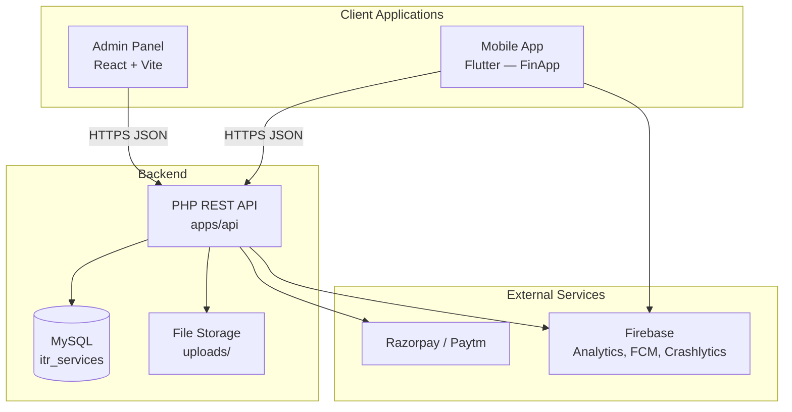

# Architecture

System design for the ITR Platform monorepo — how the three apps connect, share data, and are organized.

---

## High-level overview

The ITR Platform is a **monorepo** with one shared PHP backend and two frontend clients:



| Layer | Technology | Location |
|-------|------------|----------|
| Mobile client | Flutter 3.8+, Riverpod, GoRouter | `apps/mobile/tax_client` |
| Admin client | React 19, TypeScript, Vite, MUI, Redux | `apps/admin` |
| API server | PHP 7.4+, Apache, mysqli | `apps/api` |
| Database | MySQL 5.7+ (`itr_services`) | XAMPP / cPanel |
| Payments | Razorpay (+ Paytm optional) | `apps/api/payment/` |
| Push notifications | Firebase Cloud Messaging | Mobile + `apps/api/include/FcmHelper.php` |

---

## Monorepo structure

```
itr-platform/
├── apps/
│   ├── mobile/
│   │   └── tax_client/          # Flutter app (package: tax_client)
│   ├── api/                     # PHP REST API (served at /api)
│   └── admin/                   # React SPA (served at /admin/)
├── docs/                        # Shared platform documentation
├── scripts/                     # Dev utilities (XAMPP permissions)
└── .github/workflows/           # CI/CD (optional, later)
```

**Why this layout works:**
- One clone gives you the full stack.
- API is the single source of truth for business logic and data.
- Mobile and admin are independent deployables that share the same API contract.

---

## API architecture (`apps/api`)

### Module layout

| Module | Path | Responsibility |
|--------|------|----------------|
| **auth** | `auth/` | Signup, login, JWT refresh, password reset, FCM token, account deletion |
| **itrdetails** | `itrdetails/` | Personal details, document upload/download, user journey |
| **itr_status** | `itr_status/` | Order status, detailed timeline, concerns |
| **payment** | `payment/` | Razorpay/Paytm initiate, verify, webhook, history |
| **package** | `package/` | ITR pricing packages (CRUD) |
| **admin** | `admin/` | Dashboard, users, ITRs, assignments, analytics, notifications |
| **include** | `include/` | Shared config, CORS, FCM/payment config |
| **phpjwt** | `phpjwt/` | Custom JWT sign/verify |
| **migrations** | `migrations/` | SQL schema migrations |
| **cron** | `cron/` | Scheduled notification jobs |
| **uploads** | `uploads/` | User document files (`{PAN}/{filename}`) |

### Request flow

```
Client → Apache (/api/*.php) → PHP endpoint
  → include/config.php (DB connection)
  → JWT verify (if protected)
  → Business logic + mysqli queries
  → JSON response { statusCode, status, data }
```

### Authentication

- **Mechanism:** JWT Bearer token in `Authorization` header.
- **Issued by:** `POST /auth/login.php`
- **Payload:** `{ iss, UserId, Role, time }`
- **Roles:** `CLIENT`, `ADMIN`, `CA`, `ACCOUNTANT`, `TAX_EXPERT`
- **Config:** `$key` and `$expire` in `include/config.php`

### Database (core tables)

From `setup_database.sql`:

| Table | Purpose |
|-------|---------|
| `users` | Accounts (email, password, role, platform) |
| `services` | Service types |
| `personal_details` | ITR personal info per user/PAN |
| `document_details` | Document metadata |
| `itr_detail` | ITR records |
| `itr_source` | ITR source tracking |
| `itr_packages` | Pricing packages |

Additional tables from migrations: `payment_info`, `user_fcm_tokens`, `notifications`, assignment tables, dynamic status system. See [projects/API.md](./projects/API.md).

---

## Mobile architecture (`apps/mobile/tax_client`)

### Pattern

**Clean Architecture** per feature + **Riverpod** for state/DI:

```
Presentation (screens, widgets, ViewModels)
        ↓
Domain (entities, repository interfaces, use cases)
        ↓
Data (repository impl, remote data sources, models)
```

### Key packages

| Package | Role |
|---------|------|
| `flutter_riverpod` | State management & DI |
| `go_router` | Declarative routing |
| `freezed` + `json_serializable` | Immutable models |
| `dartz` | `Either<Failure, T>` error handling |
| `razorpay_flutter` | Payment checkout |
| `firebase_*` | Analytics, Crashlytics, FCM |

### Feature modules

```
lib/features/
├── auth/              login, signup, forgot password
├── splash/            branded splash + redirect
├── home/              dashboard, File ITR, E-Verify
├── personal_info/     form + ITR list
├── document_upload/   upload/manage documents
├── packages/          package bottom sheet
├── payment/           Razorpay flow
├── status/            ITR progress timeline
├── orders/            order list
├── more/              account menu
├── profile/           stub
├── settings/          stub
└── refer_earn/        stub
```

### Theme

Single dark `ThemeData` (`AppTheme.theme`) aligned with Figma navy `#1E1E2C`. Tokens in `lib/core/config/theme/`.

---

## Admin architecture (`apps/admin`)

### Pattern

React SPA with **Redux Toolkit** (auth state) + **TanStack React Query** (server data) + **Axios** (HTTP).

### Route structure

```
/login, /register, /forgot-password     → public
/dashboard, /itrs, /users, /packages    → authenticated (+ role gates)
```

### RBAC

Roles from API determine access:

| Role | Typical access |
|------|----------------|
| `ADMIN` | Full: users, packages, all ITRs, dashboard |
| `CA` / `ACCOUNTANT` | Assigned ITRs, professional workflows |
| `CLIENT` | Limited (should use mobile app) |

Permissions checked in `PrivateRoute` and sidebar (`VIEW_ALL_ITRS`, `ASSIGN_ITR`, etc.).

### Dev proxy

Vite proxies `/api` → `http://localhost/api` so the admin panel avoids CORS during local development.

---

## Cross-app data flow

### End-user ITR filing (mobile)

```
Login → Home → Select package → Personal info → Documents → Payment → Status timeline
```

Each step calls specific API endpoints. See [WORKFLOWS.md](./WORKFLOWS.md) and [SCREEN_API_MAP.md](./SCREEN_API_MAP.md).

### Admin ITR management

```
Login → Dashboard → ITR list → ITR detail
  → View/edit status, assign professional, review documents, submit acknowledgement
```

### Shared entities

| Entity | Mobile uses | Admin uses | API tables |
|--------|-------------|------------|------------|
| User | Login, profile | User management | `users` |
| ITR | Filing flow, status | ITR management | `itr_detail`, `personal_details` |
| Documents | Upload/view | Review/download | `document_details`, `uploads/` |
| Package | Selection, payment | CRUD | `itr_packages` |
| Payment | Razorpay checkout | — | `payment_info` |
| Status | Timeline | Update steps | Dynamic status tables |

---

## Deployment topology

| Environment | API | Admin | Mobile |
|-------------|-----|-------|--------|
| Local | XAMPP `localhost/api` | Vite dev `:5173/admin/` | Emulator/device |
| Production | `allindiaitr.in/api` | Hosted at `/admin/` | Play Store / App Store APK/IPA |

See [ENVIRONMENTS.md](./ENVIRONMENTS.md) for config per environment.

---

## Design decisions

| Decision | Rationale |
|----------|-----------|
| Monorepo | Single team, shared API contract, easier cross-app changes |
| PHP API (not Laravel) | Existing codebase, simple Apache deployment on cPanel |
| JWT auth | Stateless, works for mobile + web admin |
| Flutter for mobile | Cross-platform, existing investment |
| React for admin | Rich dashboard UI, MUI component library |
| Config files gitignored | Secrets (DB, payment keys) stay out of version control |

---

## Future considerations

- **CI/CD:** GitHub Actions for admin build, API deploy, mobile release (`.github/workflows/`)
- **API versioning:** Currently unversioned (`/api/auth/login.php`); consider `/api/v1/` if breaking changes needed
- **Password hashing:** Passwords currently compared in plain text — should migrate to `password_hash()` / `password_verify()`
- **Nested git repos:** Remove `apps/*/.git/` before first monorepo commit
