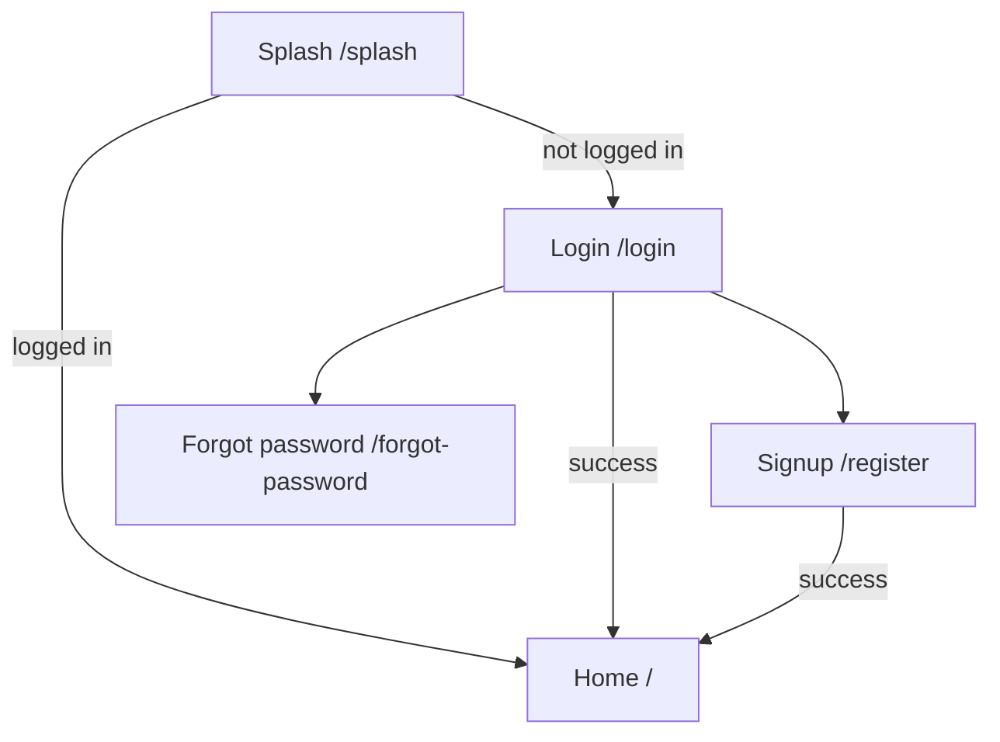
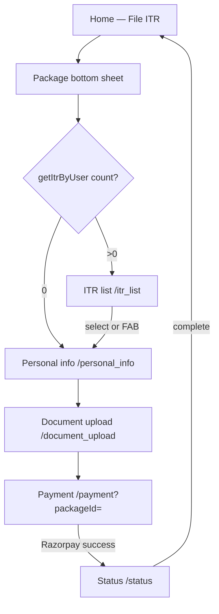
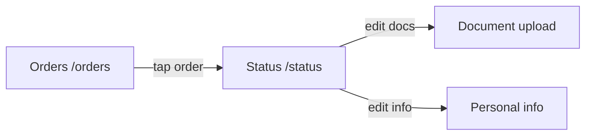
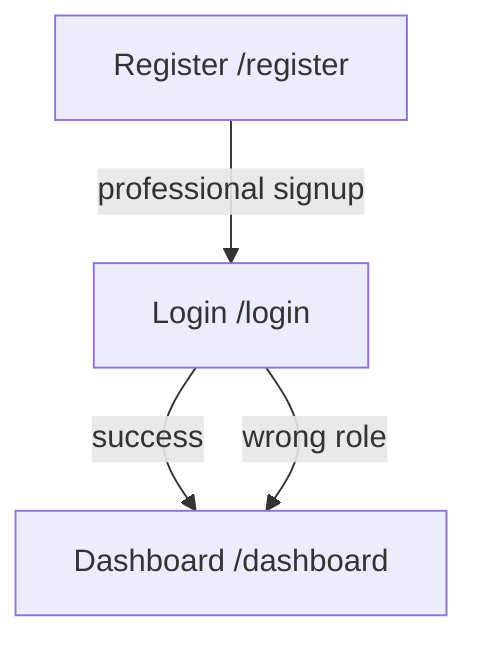
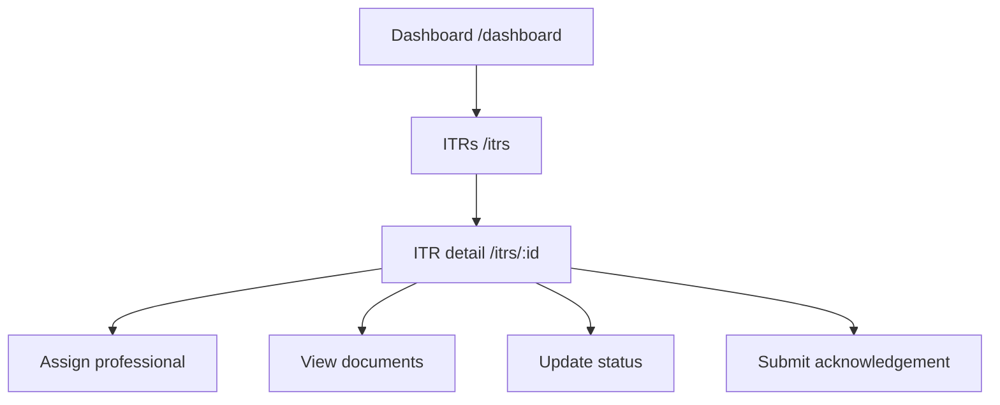
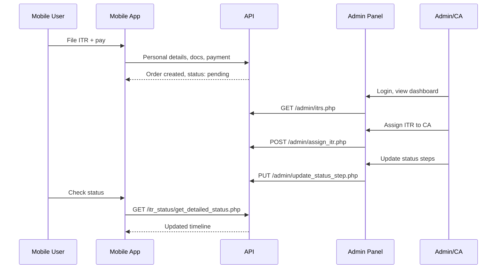

# Workflows

End-to-end user and admin journeys across the ITR Platform. Use with [SCREEN_API_MAP.md](./SCREEN_API_MAP.md) when implementing UI.

---

## 1. Mobile — App entry

| Step | Screen | API |
|------|--------|-----|
| Splash | `/splash` | Check local token storage |
| Login | `/login` | `POST /auth/login.php` |
| Signup | `/register` | `POST /auth/signup.php` |
| Forgot password | `/forgot-password` | `POST /auth/forget_password.php` |
| After login | — | `POST /auth/register_fcm.php` (FCM token) |

---

## 2. Mobile — File ITR (main journey)

### Step-by-step

| # | Action | Route | API(s) | Notes |
|---|--------|-------|--------|-------|
| 1 | Tap "File ITR" on Home | `/` | — | Sets `JourneyType.ITR` |
| 2 | Select package | Modal | `GET /package/getPackages.php` | Stores in `selectedPackageProvider` |
| 3 | Check existing ITRs | — | `GET /get_itrbyuser.php` | If count=0 → personal info; else → ITR list |
| 4 | Fill personal details | `/personal_info` | `POST /itrdetails/add_personal_details.php` | Sends `packageId` |
| 5 | Upload documents | `/document_upload` | `POST /itrdetails/add_documents.php`, `save_documents.php`, `get_documents.php` | Multi-file upload |
| 6 | Review & pay | `/payment` | `GET /payment/get_payment_info.php`, `POST /payment/initiate_payment.php`, `POST /payment/verify_payment.php` | Razorpay SDK |
| 7 | View status | `/status` | `GET /itr_status/get_detailed_status.php` | Timeline of ITR progress |

### E-Verify shortcut

Same flow as File ITR, but:
- Journey type: `JourneyType.EVerify`
- Package auto-selected: id `"7"` when available

---

## 3. Mobile — Orders tab

| Step | Route | API |
|------|-------|-----|
| List orders | `/orders` | `GET /itr_status/get_user_orders.php` |
| View status | `/status` | `GET /itr_status/get_detailed_status.php` |

---

## 4. Mobile — More / account

| Action | Route | API |
|--------|-------|-----|
| Account menu | `/more` | — |
| Logout | → `/login` | Clear local token |
| Delete account | — | `POST /auth/delete_account.php` |
| Privacy / Contact / About | WebView | Static URLs on host |

**Known bug:** More screen back button navigates to `/dashboard` (route does not exist). Should use `/`.

---

## 5. Admin — Login & registration

| Step | Route | API |
|------|-------|-----|
| Admin/pro login | `/login` | `POST /auth/login.php` |
| Professional register | `/register` | `POST /auth/register_professional.php` |
| Delete account | `/delete-account` | `POST /auth/delete_account.php` |

Role from login response determines access. `ADMIN` gets full sidebar; `CA`/`ACCOUNTANT` get assignment views.

---

## 6. Admin — Dashboard & ITR management

| Step | Route | API |
|------|-------|-----|
| Dashboard KPIs | `/dashboard` | `GET /admin/dashboard.php` |
| ITR list | `/itrs` | `GET /admin/itrs.php` |
| ITR detail | `/itrs/:id` | `GET /admin/itrs.php?id=`, `GET /get_itrbyitrid.php` |
| Personal details tab | — | `GET /itrdetails/get_personal_detail.php` |
| Documents tab | — | `GET /admin/documents.php?itrId=`, `GET /itrdetails/get_documents.php` |
| Assign ITR | — | `POST /admin/assign_itr.php` |
| Update status | — | `PUT /admin/update_status_step.php` |
| Submit acknowledgement | — | `POST /admin/submit_acknowledgement.php` |
| Add comment | — | `POST /admin/itrs.php?action=comment` |

---

## 7. Admin — User management

| Step | Route | API |
|------|-------|-----|
| User list | `/users` | `GET /admin/users.php` |
| User detail | `/users/:id` | `GET /admin/users.php?id=` |
| Edit user | — | `PUT /admin/users.php` |
| User's ITRs | — | `GET /get_itrbyuser.php?userId=` |

**Access:** `ADMIN` role only.

---

## 8. Admin — Package management

| Step | Route | API |
|------|-------|-----|
| Package list | `/packages` | `GET /package/getPackages.php` |
| Create package | `/packages/new` | `POST /package/addPackage.php` |
| Edit package | `/packages/:id` | `POST /package/addPackage.php` (with id) |
| Delete package | — | `POST /package/deletePackage.php` |

**Access:** `ADMIN` role only.

---

## 9. Admin — Professionals / assignments

| Step | Route | API |
|------|-------|-----|
| Professional list | `/professionals` | `GET /admin/users.php?role=CA` or `ACCOUNTANT` |
| View assignments | — | `GET /admin/get_assignments.php` |
| Assign ITR | — | `POST /admin/assign_itr.php` |
| Update assignment | — | `PUT /admin/update_assignment.php` |

---

## 10. Cross-app — ITR lifecycle

---

## Journey types (mobile)

| Enum | API value | Package behavior |
|------|-----------|------------------|
| `JourneyType.ITR` | `ITR` | User selects package |
| `JourneyType.EVerify` | `E-Verify` | Auto-select package id `7` |
| `JourneyType.GST` | `GST` | Commented out on home UI |
| `JourneyType.Loan` | `Loan` | Commented out on home UI |

---

## Stub screens (mobile — not yet implemented)

| Route | Screen | Status |
|-------|--------|--------|
| `/profile` | ProfileScreen | Stub |
| `/settings` | SettingsScreen | Stub |
| `/refer_earn` | ReferAndEarnScreen | Stub |

No APIs wired yet for these screens.

---

## Related docs

- [SCREEN_API_MAP.md](./SCREEN_API_MAP.md) — quick lookup table
- [API_CONTRACT.md](./API_CONTRACT.md) — request/response shapes
- [projects/MOBILE.md](./projects/MOBILE.md) — mobile routes & providers
- [projects/ADMIN.md](./projects/ADMIN.md) — admin routes & RBAC
